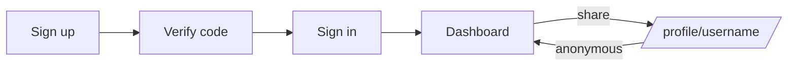

# 💬 WhisperNet

> Share your link. Get honest anonymous messages.


## ✨ Features

| | |
|---|---|
| 📝 **Sign up + verify** | Live username check, bcrypt hash, 6-digit email code (Resend) |
| 🔐 **Sign in** | Email *or* username, blocks unverified users |
| 📥 **Dashboard** | Inbox newest-first, copy link, accept ON/OFF toggle, delete |
| 🔗 **Public profile** | `/profile/[username]` — send without login (500 chars max) |
| 🤖 **AI ice-breakers** | Gemini suggestions, fixed server prompt (no prompt-injection) |
| 🌓 **Polish** | Dark mode, toasts, animated hero + carousel |

## 🚀 Quick start

```bash
nvm use
npm install
cp .env.example .env.local
npm run dev      # → http://localhost:3000
```

<details>
<summary>⚙️ Env vars (.env.local)</summary>

```env
MONGODB_URI="mongodb://localhost:27017/whisper"
RESEND_API_KEY="..."
EMAIL_FROM="onboarding@resend.dev"
NEXTAUTH_SECRET="..."  # openssl rand -base64 32
NEXTAUTH_URL="http://localhost:3000"
GEMINI_API_KEY="..."
```

</details>

| Command | Use |
|---|---|
| `npm run dev` | Local dev (Turbopack) |
| `npm run build` / `npm start` | Production build / serve |
| `npm run lint` | ESLint |

> Demo hint on `/sign-in` (`admin12 / password`) only fills the form — you still need a real verified user in MongoDB.

## 🔄 How it works



<details>
<summary>📡 API cheat-sheet</summary>

| Method | Route | Auth |
|---|---|---|
| POST | `/api/sign-up`, `/api/verify-code` | public |
| GET | `/api/check-username-unique` | public |
| POST | `/api/send-message` | public |
| GET | `/api/get-messages` | 🔒 |
| GET/POST | `/api/accept-message` | 🔒 |
| DELETE | `/api/delete-message/[id]` | 🔒 |
| POST | `/api/suggest-messages` | public |

</details>

## ✅ What's good

- App Router split: `(auth)` / `(app)` / `profile` / `api`
- Zod validation client + server, debounced UX, safe Mongoose caching
- Server-enforced: verified-only login, accept-toggle, ObjectId checks

## 🔭 Recommended next

- [ ] Rate-limit + CAPTCHA on public send, profanity filter
- [ ] Forgot password, resend-code cooldown, Auth.js v5
- [ ] Mongo indexes + inbox pagination
- [ ] Vitest + Playwright, Sentry, seed script + CI

<details>
<summary>📁 Structure</summary>

```
(auth)/sign-in|sign-up|verify/[username]
(app)/dashboard              inbox
profile/[username]           public send
api/...                      routes above
model/User.ts + lib/dbConnect.ts
schemas/ + components/ui/    Zod + shadcn
proxy.ts                     auth guard
```

</details>
